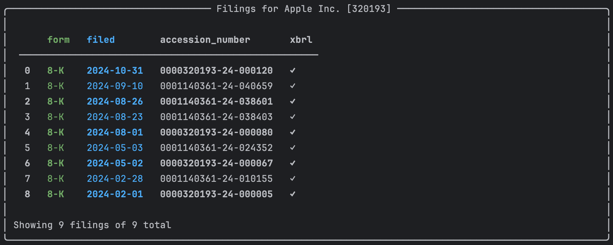
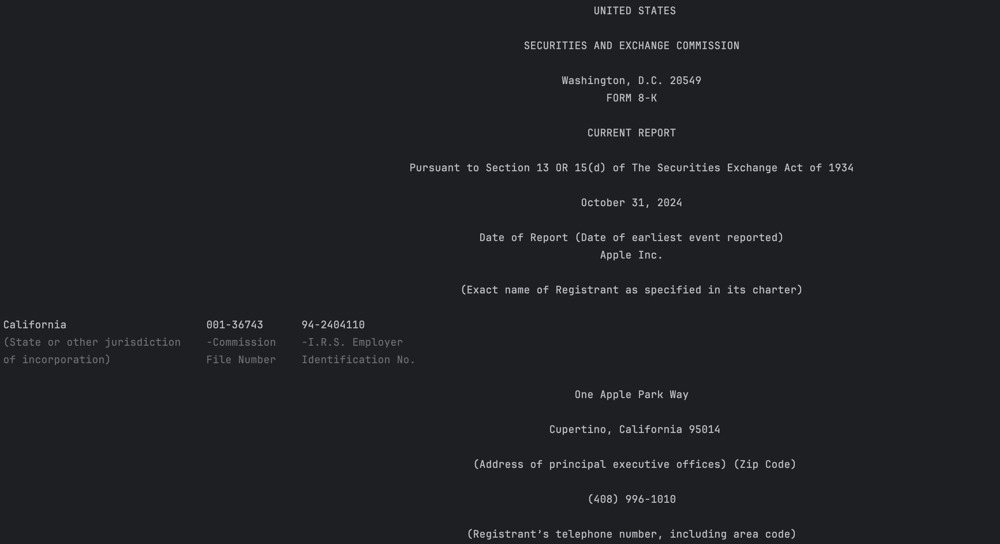
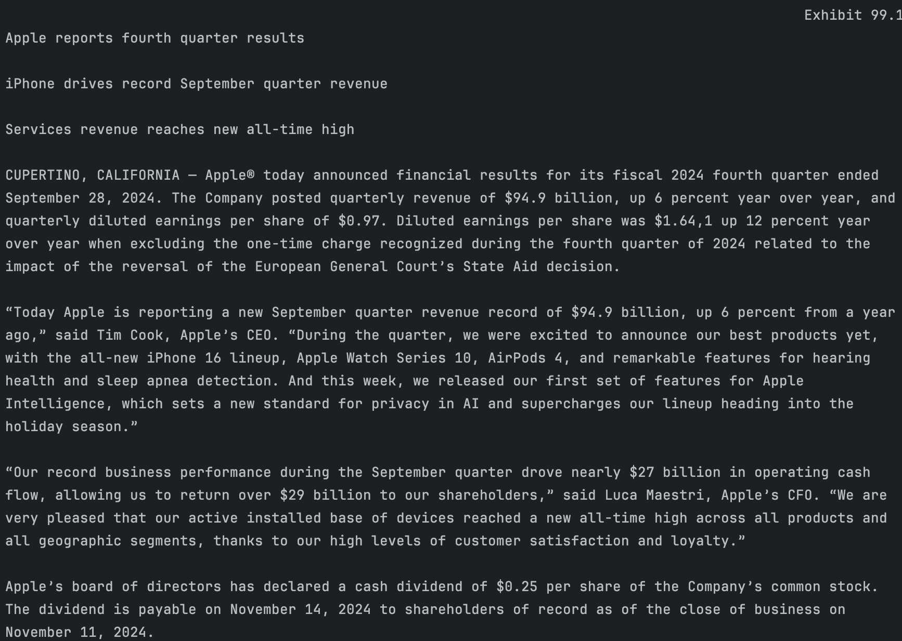

# Eight-K Filings

Imagine having instant access to a company's most critical corporate updates the moment they happen!

8-K filings are real-time windows into significant corporate events, revealing everything from 
leadership changes to major business transformations.

With **edgartools**, you can effortlessly retrieve and analyze these crucial SEC documents in just a few lines of Python code. 


## Getting 8-K filings for a company

The easiest way to get **8-K** filings is to get access to a company object and use the `latest` function.
You can restrict to the latest 5 filings by passing `n` as a parameter.

This returns a `Filings` object with multiple filings so to get a single filing use the bracket `[]` operator e.g. `filings[1]`.

```python
c = Company("AAPL")

filings = filings.latest("8-K", 5)
```


To get the last filing use `latest` without `n`. This returns a single `Filing` object.

```python
filing = filings.latest("8-K")
```


### Getting all 8-K filings

Another way to get 8-K filings is to use `get_filings(form="8-K")`. This gets all the filings for a company, but also allow for filtering by date

```python
filings = c.get_filings(form='8-K')
```

### Filtering by date

You can also filter the filings by date using a range 'YYYY-MM-DD:YYYY-MM-DD' or from a specific date 'YYYY-MM-DD:' or before a specific date ':YYYY-MM-DD'.

```python
filings = c.get_filings(form='8-K', date='2022-01-01:')
```



## Viewing the 8-K filing

Once you have the 8-K filing you can view it in the browser using `filing.open()`

```python
filing.open()
```

You can also view it in the console using `filing.view()`

```python
filing.view()
```



### Viewing the filing exhibits

**8-K** filings often gave attached exhibits which contain the informnation the company is releasing in the filing. 
You can view the list of exhibits using `filing.exhibits`

```python
filing.exhibits 
``` 


### Viewing a specific exhibit

To select a specific exhibit use the bracket `[]` operator e.g. `filing.exhibits[0]`. This selects the first exhibit, so `filing.exhibits[1]` selects the second exhibit.

To view the exhibit `filing.exhibits[1].view()`

```python
filing.exhibits[1].view()
```




### Downloading the exhibit

To download the exhibit use `filing.exhibits[1].download()`. Note that this downloads the file into memory, while you may want to download to a path.
To download to a path use `filing.exhibits[1].download(path="path/to/save")`

```python
filing.exhibits[1].download()
```
